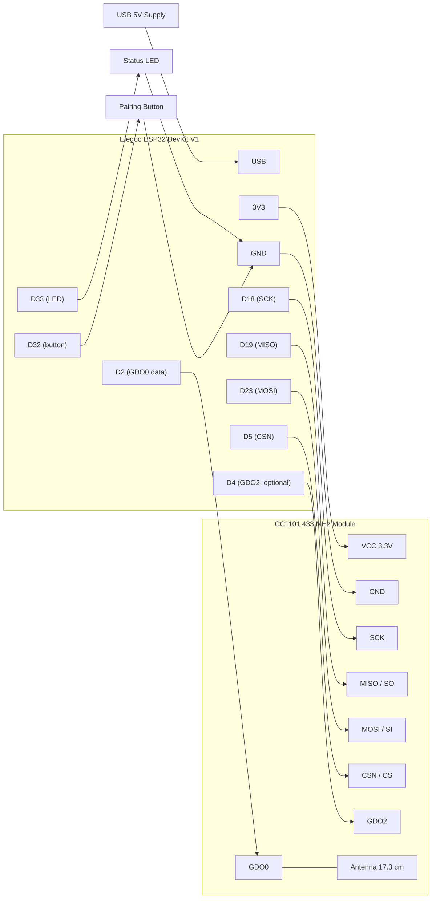

# Hardware Reference

- [Canonical Build](#canonical-build)
- [Bill Of Materials](#bill-of-materials)
- [Power](#power)
- [CC1101 Radio Wiring](#cc1101-radio-wiring)
- [Button And LED Wiring](#button-and-led-wiring)
- [Wiring Diagram](#wiring-diagram)
- [Wiring Validation](#wiring-validation)
- [Radio Range](#radio-range)
- [Direction Semantics](#direction-semantics)

## Canonical Build

This project is built around one canonical hardware configuration:

- Elegoo ESP32 DevKit V1 (`ESP32-WROOM-32`), confirmed to have 4 MB of flash.
- CC1101 433 MHz transceiver module, tuned in firmware to 433.42 MHz.
- Quarter-wave antenna (about 17.3 cm of solid-core wire) or the module's supplied whip or SMA antenna.
- One panel-mount momentary pushbutton and one panel-mount status LED with a series resistor.
- One 5V USB power supply into the ESP32 USB port.

The ESP32 sets up the CC1101 over SPI once, then bit-bangs the Somfy waveform onto the `GDO0` data line while the CC1101 keys the 433.42 MHz carrier to match. This is a transmit-only design; there is no radio feedback from the motor.

## Bill Of Materials

The links are examples of where to source each part. Verify the exact module before buying, and prefer the specific chips called out in the notes.

| Qty | Part | Purpose | Notes |
| --- | --- | --- | --- |
| 1 | Elegoo ESP32 DevKit V1 (`ESP32-WROOM-32`) | Main controller, Wi-Fi, Matter | Confirm 4 MB flash. 3.3V logic, not 5V tolerant. |
| 1 | CC1101 433 MHz transceiver module | Tunable 433.42 MHz radio | Must be the 433 MHz variant. The Ebyte `E07-M1101D` is a good antenna-equipped option. Power from ESP32 `3V3`, never 5V. |
| 1 | 433 MHz antenna or 17.3 cm solid-core wire | Improves range | A quarter-wave whip at 433.42 MHz is about 17.3 cm. Many modules include a spring or SMA antenna. |
| 1 | 5V USB power supply | Power input | Any phone-style USB supply into the ESP32 USB port. |
| 1 | Panel-mount momentary pushbutton (normally open, 12 mm) | Pairing and reset button | Mounts through the enclosure wall so it stays pressable once the box is closed. Any SPST normally-open momentary switch works. |
| 1 | Panel-mount LED plus ~330 ohm resistor | Pairing and status feedback | Visual confirmation for headless, in-the-box operation. Driven from a spare GPIO. |
| 10 | 22 to 26 AWG jumper or Dupont leads | Wiring | Seven CC1101 connections, two for the button, two for the LED, plus spares. |
| 1 | Breadboard or small protoboard | Assembly | Solder to protoboard for a permanent build. |
| 1 | Small enclosure (optional) | Protection and mounting | Mount indoors within radio range of the motor. |
| 1 | Multimeter | Validation | Continuity and 3.3V checks before power-on. |
| 1 | Soldering iron | Assembly | For headers and the antenna wire. |

## Power

The device runs from one 5V USB supply plugged into the ESP32. The CC1101 draws its power from the ESP32 `3V3` pin, not 5V, because its logic is 3.3V and it is not 5V tolerant. All components must share a common ground.

## CC1101 Radio Wiring

The CC1101 connects over the standard VSPI bus (four pins) plus one data line and power. The data line is the key detail: the Somfy library toggles a single GPIO very fast, and that GPIO must be wired to the CC1101 `GDO0` pin, which the radio is configured to transmit in on-off-keying mode.

| ESP32 Pin | GPIO | CC1101 Pin | Purpose |
| --- | --- | --- | --- |
| `3V3` | 3.3V | `VCC` | Radio power (do not use 5V) |
| `GND` | GND | `GND` | Shared ground |
| `D18` | 18 | `SCK` | SPI clock |
| `D19` | 19 | `MISO` (SO) | SPI data from radio |
| `D23` | 23 | `MOSI` (SI) | SPI data to radio |
| `D5` | 5 | `CSN` (CS) | SPI chip select |
| `D2` | 2 | `GDO0` | Somfy data output, on-off-keying input to radio |
| `D4` | 4 | `GDO2` | Optional, leave unconnected for transmit-only |

## Button And LED Wiring

The dedicated pairing button and status LED use spare GPIOs. The button relies on the ESP32 internal pull-up, so it needs no external resistor: wire it between the GPIO and ground, and a press reads LOW. The onboard BOOT button is deliberately not used at runtime because it ends up sealed inside the enclosure.

| ESP32 Pin | GPIO | Connects To | Purpose |
| --- | --- | --- | --- |
| `D32` | 32 | Pushbutton leg A | Pairing and reset button input (internal pull-up) |
| `GND` | GND | Pushbutton leg B | Button return to ground |
| `D33` | 33 | LED anode via ~330 ohm resistor | Pairing and status feedback |
| `GND` | GND | LED cathode | LED return to ground |

The button action is chosen by how long it is held, and the LED confirms each action. See [the pairing procedure](pairing.md) for how the durations map to Somfy commands.

| Action | Hold duration | Effect | LED feedback |
| --- | --- | --- | --- |
| Short press | Under 1 second | Somfy My (stop) | Single short blink |
| Medium press | About 3 seconds | Somfy Prog (add-a-remote) | Rapid six-blink flurry |
| Long press | About 10 seconds | Matter factory reset | Slow four-blink pattern |

## Wiring Diagram

## Wiring Validation

With USB disconnected, confirm the wiring before first power-on:

1. Confirm CC1101 `VCC` goes to ESP32 `3V3` and never to `5V`.
2. Confirm all grounds are common.
3. Confirm the SPI pins map exactly: 18 to `SCK`, 19 to `MISO`, 23 to `MOSI`, 5 to `CSN`.
4. Confirm GPIO2 goes to `GDO0`, the data line the Somfy code toggles.
5. Confirm the pairing button bridges GPIO32 to ground: with the internal pull-up it reads HIGH when released and LOW when pressed.
6. Confirm the antenna is attached before transmitting. Transmitting without an antenna can damage the radio.

Then power the ESP32 by USB and open the serial monitor at 115200 baud. A healthy boot logs that the CC1101 initialized at 433.42 MHz. If it logs that the CC1101 was not detected, re-check the SPI wiring and 3V3 power before going further.

## Radio Range

The awning motor is usually near a wall inside which the physical remote already works, so a modest indoor placement with the quarter-wave antenna is normally enough. If range is marginal, a higher-output module such as the `E07-M1101D` with an external SMA antenna helps. Always validate from the intended mounting spot, not just next to the motor.

## Direction Semantics

Matter treats 0 percent lift as fully open (retracted) and 100 percent as fully closed (extended). Somfy uses Up to retract and Down to extend. The default maps Matter Open to Somfy Up and Matter Close to Somfy Down, which is convention-correct.

Some people naturally say "open the awning" to mean "deploy it for shade," which is the opposite. If the direction feels backward in daily use, flip the `INVERT_DIRECTION` build flag and reflash, or simply rename the device in the controller app. The flag changes only the physical motor direction; the reported Matter state stays convention-correct.
