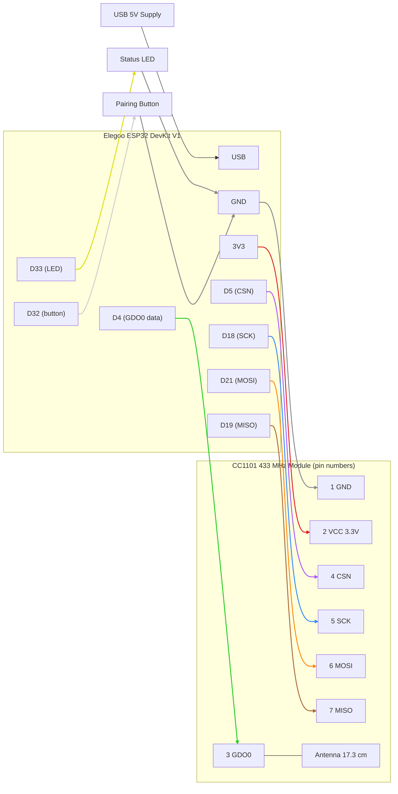

# Hardware Reference

- [Canonical Build](#canonical-build)
- [Ordering Checklist](#ordering-checklist)
- [Bill Of Materials](#bill-of-materials)
- [Power](#power)
- [CC1101 Radio Wiring](#cc1101-radio-wiring)
- [Button And LED Wiring](#button-and-led-wiring)
- [Wiring Diagram](#wiring-diagram)
- [Wiring Validation](#wiring-validation)
- [Radio Range](#radio-range)
- [Direction Semantics](#direction-semantics)

## Canonical Build

This project is built around one canonical hardware configuration:

- Elegoo ESP32 DevKit V1 (`ESP32-WROOM-32`), confirmed to have 4 MB of flash.
- CC1101 433 MHz transceiver module, tuned in firmware to 433.42 MHz. This build uses the Ebyte `E07-M1101D-SMA`.
- Quarter-wave antenna (about 17.3 cm of solid-core wire) or the module's supplied whip or SMA antenna.
- One panel-mount momentary pushbutton and one panel-mount status LED with a series resistor.
- One 5V USB power supply into the ESP32 USB port.

The ESP32 sets up the CC1101 over SPI once, then bit-bangs the Somfy waveform onto the `GDO0` data line while the CC1101 keys the 433.42 MHz carrier to match. This is a transmit-only design; there is no radio feedback from the motor.

## Ordering Checklist

Most first-build failures trace back to buying the wrong radio. Confirm these before ordering, then use the full [Bill Of Materials](#bill-of-materials) for the complete list.

- Buy a **CC1101** module, not a fixed-frequency 433 MHz transmitter such as the FS1000A. North American Somfy RTS is 433.42 MHz, and only a synthesizer radio like the CC1101 can be tuned there in firmware. A fixed 433.92 MHz board is about 500 kHz off and generally will not key the motor. This is the single most important choice.
- Get the **433 MHz variant** of the CC1101 (the chip also ships in 868 and 915 MHz module builds). The Ebyte `E07-M1101D-SMA` is the known-good module this build uses: 433 MHz, 10 dBm, SPI, 3.3V logic, with an SMA antenna connector.
- Confirm the antenna suits 433 MHz: the module's supplied whip or SMA antenna, or about 17.3 cm of solid-core wire for a quarter-wave. Do not transmit without an antenna attached.
- Confirm the ESP32 is an `ESP32-WROOM-32` with **4 MB of flash**, the practical minimum for Matter. The Elegoo DevKit V1 qualifies.
- Everything on the CC1101 side is **3.3V logic**. The ESP32 is not 5V tolerant, and the CC1101 is powered from the ESP32 `3V3` pin, so no level shifting or separate supply is needed.
- The pushbutton and LED are **panel-mount** so they remain usable once the device is sealed in an enclosure; the tiny onboard BOOT button is deliberately not used at runtime.

## Bill Of Materials

The links are examples of where to source each part. Verify the exact module before buying, and prefer the specific chips called out in the notes.

| Qty | Part | Purpose | Notes |
| --- | --- | --- | --- |
| 1 | Elegoo ESP32 DevKit V1 (`ESP32-WROOM-32`) | Main controller, Wi-Fi, Matter | Confirm 4 MB flash. 3.3V logic, not 5V tolerant. |
| 1 | CC1101 433 MHz transceiver module | Tunable 433.42 MHz radio | Must be the 433 MHz variant. This build uses the Ebyte `E07-M1101D-SMA`, whose pins are numbered rather than named; see [CC1101 Radio Wiring](#cc1101-radio-wiring). Power from ESP32 `3V3`, never 5V. |
| 1 | 433 MHz antenna or 17.3 cm solid-core wire | Improves range | A quarter-wave whip at 433.42 MHz is about 17.3 cm. Many modules include a spring or SMA antenna. |
| 1 | 5V USB power supply | Power input | Any phone-style USB supply into the ESP32 USB port. |
| 1 | Panel-mount momentary pushbutton (normally open, 12 mm) | Pairing and reset button | Mounts through the enclosure wall so it stays pressable once the box is closed. Any SPST normally-open momentary switch works. |
| 1 | Panel-mount LED plus ~330 ohm resistor | Pairing and status feedback | Visual confirmation for headless, in-the-box operation. Driven from a spare GPIO. |
| 10 | 22 to 26 AWG jumper or Dupont leads | Wiring | Seven CC1101 connections, two for the button, two for the LED, plus spares. |
| 1 | Breadboard or small protoboard | Assembly | Solder to protoboard for a permanent build. |
| 1 | Small enclosure (optional) | Protection and mounting | Mount indoors within radio range of the motor. |
| 1 | Multimeter | Validation | Continuity and 3.3V checks before power-on. |
| 1 | Soldering iron | Assembly | For headers and the antenna wire. |

## Power

The device runs from one 5V USB supply plugged into the ESP32. The CC1101 draws its power from the ESP32 `3V3` pin, not 5V, because its logic is 3.3V and it is not 5V tolerant. All components must share a common ground.

## CC1101 Radio Wiring

The CC1101 connects over the standard VSPI bus (four pins) plus one data line and power. The data line is the key detail: the Somfy library toggles a single GPIO very fast, and that GPIO must be wired to the CC1101 `GDO0` pin, which the radio is configured to transmit in on-off-keying mode.

Many CC1101 modules, including the Ebyte `E07-M1101D-SMA` used for this build, silkscreen only the pin numbers rather than signal names. The `CC1101 Pin` column below gives the number alongside the signal so the module can be wired without a datasheet in hand.

| ESP32 Pin | GPIO | CC1101 Pin | Purpose |
| --- | --- | --- | --- |
| `3V3` | 3.3V | 2 (`VCC`) | Radio power (do not use 5V) |
| `GND` | GND | 1 (`GND`) | Shared ground |
| `D18` | 18 | 5 (`SCK`) | SPI clock |
| `D19` | 19 | 7 (`MISO`, also `GDO1`) | SPI data from radio |
| `D21` | 21 | 6 (`MOSI`) | SPI data to radio |
| `D5` | 5 | 4 (`CSN`) | SPI chip select |
| `D4` | 4 | 3 (`GDO0`) | Somfy data output, on-off-keying input to radio |

The full `E07-M1101D-SMA` pinout, for reference while wiring:

| Pin | Signal | Used here |
| --- | --- | --- |
| 1 | `GND` | Yes |
| 2 | `VCC` | Yes |
| 3 | `GDO0` | Yes, the Somfy data line |
| 4 | `CSN` | Yes |
| 5 | `SCK` | Yes |
| 6 | `MOSI` | Yes |
| 7 | `MISO` / `GDO1` | Yes, as `MISO` |
| 8 | `GDO2` | No, leave unconnected |

Confirm the numbering against your own module's silkscreen or datasheet before wiring, since pin order varies between CC1101 breakout designs. Pin 7 serves double duty as `MISO` and `GDO1`; this design uses it only as the SPI data line from the radio.

Leave pin 8 (`GDO2`) unconnected. On the CC1101 both `GDO0` and `GDO2` are software-configurable status outputs, useful mainly for receiving (signalling events such as a received packet to an interrupt pin). This design is transmit-only, so the firmware configures `GDO0` alone and never reads `GDO2`. Wiring it would reserve a GPIO for nothing. It is only worth revisiting if receive support is ever added, for example to sniff the physical remote's frames.

## Button And LED Wiring

The dedicated pairing button and status LED use spare GPIOs. The button relies on the ESP32 internal pull-up, so it needs no external resistor: wire it between the GPIO and ground, and a press reads LOW. The onboard BOOT button is deliberately not used at runtime because it ends up sealed inside the enclosure.

| ESP32 Pin | GPIO | Connects To | Purpose |
| --- | --- | --- | --- |
| `D32` | 32 | Pushbutton leg A | Pairing and reset button input (internal pull-up) |
| `GND` | GND | Pushbutton leg B | Button return to ground |
| `D33` | 33 | LED anode via ~330 ohm resistor | Pairing and status feedback |
| `GND` | GND | LED cathode | LED return to ground |

The button action is chosen by how long it is held, and the LED briefly confirms each action with an acknowledgment pattern before returning to its idle status code. See [the pairing procedure](pairing.md) for how the durations map to Somfy commands.

| Action | Hold duration | Effect | LED acknowledgment |
| --- | --- | --- | --- |
| Short press | Under 1 second | Stop the awning (Somfy calls this `My`) | Single short blink |
| Medium press | About 3 seconds | Pair with the awning (Somfy calls this `Prog`) | Rapid six-blink flurry |
| Long press | About 10 seconds | Full factory reset: clears Wi-Fi credentials and decommissions Matter; device reopens `Awning-Setup` portal on next boot | Slow four-blink pattern |

While idle (not acknowledging a button press), the LED reports device state as a repeating count of short pulses, with a 1.5-second gap between repetitions; the pulse count is the code, evaluated most-blocking-first so the LED always shows the next thing to fix. Solid on, with no counting, means the device is still booting.

| Pulses | Meaning |
| --- | --- |
| 1 | Ready: Wi-Fi is up, Matter is commissioned, and the radio is detected |
| 2 | Waiting for Wi-Fi setup: the device is hosting the `Awning-Setup-XXXX` portal |
| 3 | Cannot reach Wi-Fi: credentials are stored but the device is not connecting |
| 4 | Not yet added to Google Home: on Wi-Fi, but no Matter fabric yet |
| 5 | Radio not detected: the CC1101 did not respond over SPI |

## Wiring Diagram

```mermaid
flowchart LR
    usb["USB 5V Supply"] --> esp32_usb
    subgraph esp32["Elegoo ESP32 DevKit V1"]
      esp32_usb["USB"]
      esp32_3v3["3V3"]
      esp32_gnd["GND"]
      esp32_d4["D4 (GDO0 data)"]
      esp32_d5["D5 (CSN)"]
      esp32_d18["D18 (SCK)"]
      esp32_d19["D19 (MISO)"]
      esp32_d21["D21 (MOSI)"]
      esp32_d32["D32 (button)"]
      esp32_d33["D33 (LED)"]
    end
    subgraph cc1101["CC1101 433 MHz Module (pin numbers)"]
      cc_gnd["1 GND"]
      cc_vcc["2 VCC 3.3V"]
      cc_gdo0["3 GDO0"]
      cc_csn["4 CSN"]
      cc_sck["5 SCK"]
      cc_mosi["6 MOSI"]
      cc_miso["7 MISO"]
      cc_ant["Antenna 17.3 cm"]
    end

    esp32_3v3 --> cc_vcc
    esp32_gnd --> cc_gnd
    esp32_d18 --> cc_sck
    esp32_d19 --> cc_miso
    esp32_d21 --> cc_mosi
    esp32_d5 --> cc_csn
    esp32_d4 --> cc_gdo0
    cc_gdo0 --- cc_ant

    button["Pairing Button"]
    led["Status LED"]
    esp32_d32 --> button
    button --> esp32_gnd
    esp32_d33 --> led
    led --> esp32_gnd

    %% Edge colors match the as-built wire colors listed below the diagram.
    %% linkStyle indices are positional, counted from 0 in the order the edges
    %% are declared above, so adding or reordering an edge shifts them.
    linkStyle 1 stroke:#d22,stroke-width:2px
    linkStyle 2,10,12 stroke:#888,stroke-width:2px
    linkStyle 3 stroke:#38f,stroke-width:2px
    linkStyle 4 stroke:#a63,stroke-width:2px
    linkStyle 5 stroke:#f80,stroke-width:2px
    linkStyle 6 stroke:#a5f,stroke-width:2px
    linkStyle 7 stroke:#2c2,stroke-width:2px
    linkStyle 9 stroke:#ccc,stroke-width:2px
    linkStyle 11 stroke:#dd0,stroke-width:2px
```

Wire colors used for this build. The diagram edges above are tinted to match, and the colors are a convenience only: the pin numbers and signal names are what matter when wiring.

| Wire color | ESP32 | Destination | Signal |
| --- | --- | --- | --- |
| Red | `3V3` | CC1101 pin 2 | `VCC` |
| Dark gray or black | `GND` | CC1101 pin 1 | `GND` |
| Blue | `D18` | CC1101 pin 5 | `SCK` |
| Brown | `D19` | CC1101 pin 7 | `MISO` |
| Orange | `D21` | CC1101 pin 6 | `MOSI` |
| Purple | `D5` | CC1101 pin 4 | `CSN` |
| Green | `D4` | CC1101 pin 3 | `GDO0`, the Somfy data line |
| Light gray | `D32` | Pushbutton leg A | Pairing button input |
| Yellow | `D33` | LED anode via resistor | Status LED |

Keep red and black reserved for power so anything red is unambiguously `VCC`. The button and LED both return to `GND`, and those return legs share the ground wire color.

## Wiring Validation

With USB disconnected, confirm the wiring before first power-on:

1. Confirm CC1101 `VCC` (pin 2) goes to ESP32 `3V3` and never to `5V`.
2. Confirm all grounds are common, including CC1101 `GND` (pin 1).
3. Confirm the SPI pins map exactly: GPIO18 to `SCK` (pin 5), GPIO19 to `MISO` (pin 7), GPIO21 to `MOSI` (pin 6), GPIO5 to `CSN` (pin 4).
4. Confirm GPIO4 goes to `GDO0` (pin 3), the data line the Somfy code toggles. Do not use GPIO2: it is a strapping pin, and because the CC1101 drives `GDO0` as an output by default, a powered radio on GPIO2 blocks the ESP32 from entering download mode, so uploads fail until the wire is pulled.
5. Confirm `GDO2` (pin 8) is left unconnected.
6. Confirm the pairing button bridges GPIO32 to ground: with the internal pull-up it reads HIGH when released and LOW when pressed.
7. Confirm the antenna is attached before transmitting. Transmitting without an antenna can damage the radio.

Then power the ESP32 by USB and open the serial monitor at 115200 baud. A healthy boot logs that the CC1101 initialized at 433.42 MHz. If it logs that the CC1101 was not detected, re-check the SPI wiring and 3V3 power before going further.

## Radio Range

The awning motor is usually near a wall inside which the physical remote already works, so a modest indoor placement with the quarter-wave antenna is normally enough. If range is marginal, a higher-output module such as the `E07-M1101D` with an external SMA antenna helps. Always validate from the intended mounting spot, not just next to the motor.

## Direction Semantics

Matter treats 0 percent lift as fully open (retracted) and 100 percent as fully closed (extended). Somfy uses Up to retract and Down to extend. The default maps Matter Open to Somfy Up and Matter Close to Somfy Down, which is convention-correct.

Some people naturally say "open the awning" to mean "deploy it for shade," which is the opposite. If the direction feels backward in daily use, flip the `INVERT_DIRECTION` build flag and reflash, or simply rename the device in the controller app. The flag changes only the physical motor direction; the reported Matter state stays convention-correct.
